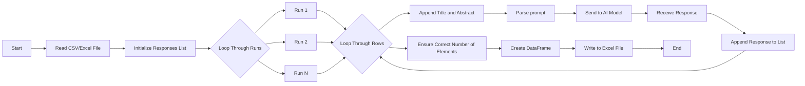

# AI Assisted Analysis Tool


This project is an open-source, locally run AI-assisted text or image analysis tool powered by Ollama. It now supports three distinct workflows:

## 1. Analysis Workflow - Text

**Purpose:** Analyze any tabular data (Excel or CSV) using AI, not limited to abstracts. This workflow is flexible and user-friendly, allowing you to select which columns to analyze and how the results are reported.

**Key Features:**
- Works with any Excel or CSV file (not just abstracts)
- Lists all columns and lets you select identifier and content columns by name
- Lets you define what you want the AI to identify in your data (custom prompt)
- Allows you to set the number of analysis runs for each row
- Optionally aggregates AI responses for consensus and confidence
- Optionally appends all reporting info (prompt, LLM, runs, hardware, consensus summary, etc.) to the bottom of the Excel output file
- Enhanced reporting: includes prompt, LLM used, number of runs, analysis duration, CPU/GPU info
- Cross-platform: Windows, macOS, Linux

**How to Use:**
1. Prepare your Excel or CSV file and place it in your chosen data input folder.
2. Make sure you also have a data output folder for your file to be saved in after the analysis.
3. Run the script:
    ```powershell
    python text_analysis.py
    ```
4. Follow the prompts:
   - Select the AI model (or press Enter for the recommended model)
   - Enter what you want the program to identify in your data (custom prompt)
   - Choose columns for identifier and content by name
   - Set the number of runs for analysis
   - Optionally aggregate AI responses for consensus and confidence
   - Optionally append all reporting info to the bottom of the output Excel file
5. Review your results in the output Excel file (includes consensus columns and reporting info if selected)

## 2. Analysis Workflow — Image

**Purpose:** Analyze images using local vision-capable models and compare responses across models.

**Key Features:**
- Run one or more vision models sequentially to avoid constant context switching
- Run multiple replicates per image and record per-model Response_1..N
- Compute per-model Consensus and Consensus_Confidence using modes: `exact`, `set`, or `fuzzy`
- Fuzzy consensus uses `rapidfuzz` to cluster similar responses (install `rapidfuzz` to enable)
- Progress bars (tqdm) and an optional inter-model `switch_delay` to allow operator/model switching
- Output is an Excel file with a metadata sheet containing prompt, model(s), runs, duration, and environment info

**How to Use:**
1. Prepare a folder containing your image files and create an output folder for results.
2. Make sure your local Ollama runtime has a vision-capable model available (for example: `gemma2-vision`). Pull it if needed:
    ```powershell
    ollama pull gemma2-vision
    ```
3. Run the script:
    ```powershell
    python image_analysis.py
    ```
4. Follow the prompts:
    - Select the vision model to use (or press Enter for the recommended model)
    - Set the number of runs per image (replications)
    - Choose a consensus mode: `exact`, `set`, or `fuzzy` (set uses normalized sets, fuzzy groups similar responses)
    - If using `fuzzy`, set a fuzzy threshold (default shown in the prompt) and ensure `rapidfuzz` is installed
    - Optionally set `switch_delay` (seconds) to pause between models when running multiple models sequentially
    - Choose whether to append reporting metadata to the output Excel file
5. Inspect the Excel output: each model has Response_1..N columns followed by `Consensus` and `Consensus_Confidence`; a `metadata` sheet contains run details.

**Notes:**
- Install Python dependencies listed in `requirements.txt`. For fuzzy consensus, ensure `rapidfuzz` is present:
  ```powershell
  pip install rapidfuzz
  ```
- PowerShell users: run the commands above in an activated virtual environment to ensure packages are available.


## 3. Zotero Abstracts Workflow - Text

**Purpose:** Analyze bibliographic abstracts exported from Zotero. This workflow is designed for users working specifically with Zotero data and abstracts.

**Key Features:**

**How to Use:**
1. Export your collection from Zotero as a CSV or Excel file
2. Use the provided scripts (e.g., `methods.py`, `results.py`, `location.py`, `theory.py`, `n_themes.py`) in the `python_for_Zotero_abstracts` folder to run targeted analyses on your exported data
3. Follow the prompts in each script for results and consensus aggregation
4. Review your results in the output Excel file


## Requirements
   - `ollama` - Python client for Ollama
      - [Ollama for Windows](https://ollama.com/download/windows)
      - [Ollama for Mac](https://ollama.com/download/mac)
      - [Ollama for Linux](https://ollama.com/download/linux)
  - `pandas` - Data manipulation and analysis
  - `tqdm` - Progress bars
  - `openpyxl` - Excel file handling

## AI Assisted Analysis Tool

### Project Goals
This project aims to provide tools for AI-assisted analysis and aggregation of responses, supporting research workflows and data exploration.

### Features
- Aggregates AI responses from various sources
- Modular analysis methods (see `other_analysis/` and `python_for_Zotero_abstracts/`)
- Extensible for new data formats and sources

### Installation
1. Clone the repository:
    ```powershell
    git clone https://github.com/hleve/AI_Assisted_Analysis_Tool.git
    ```
2. Install dependencies:
    ```powershell
    pip install -r requirements.txt
    ```

### Usage Example
Run the text-analysis script:
```powershell
python text_analysis.py
```

Run the image-analysis script (compare vision models):
```powershell
python image_analysis.py
```

### Getting Started
See `documentation.md` for a step-by-step guide.

### Contributing
Contributions are welcome! Please see `CONTRIBUTING.md` for contribution guidelines, issue templates, and the code of conduct.


### License
See `LICENSE` for details.

---

## Project Logic and Methodology

This tool is designed to leverage AI models for research analysis, with a focus on reliability and reproducibility. The core logic includes:

- **Replication for Error Minimization:**
    - Analyses are run multiple times (replicated) to reduce the impact of random errors or outlier responses from AI models.
    - Aggregation and consensus algorithms are used to combine results, improving reliability and confidence in findings.

- **Prompt Engineering for Quantitative Analysis:**
    - Prompts can be crafted to request numerical values from AI models (e.g., ratings, counts, scores).
    - These outputs can be collected across replications and subjected to standard statistical analyses, such as ANOVA or T-tests, to assess differences, trends, or significance.

This approach allows researchers to harness the flexibility of AI while maintaining scientific rigor and transparency in their workflows.

## Prompts (Zotero Abstracts Workflow)

The following scripts in `python_for_Zotero_abstracts` are designed for specific types of analysis:

- `theory.py`: Identify urban planning theory used in abstracts
- `n_themes.py`: Identify three themes from abstracts
- `methods.py`: Identify methods used in abstracts
- `results.py`: Identify results from abstracts
- `location.py`: Identify where the research was conducted

Each script will prompt you for the required input and provide results in the output Excel file.

## How to Use


### Custom Analysis Workflow (text_analysis.py)

1. **Prepare Your Data**: Place your CSV or Excel file in the data input folder.
2. **Run the Script**:
    ```powershell
    python text_analysis.py
    ```
3. **Follow Prompts**:
   - Select the model to use (or press Enter for the recommended model).
   - Define what you want the program to identify within the text.
   - Choose columns for identifier and content by name.
   - Set the number of runs for analysis.
4. **Consensus & Reporting**:
   - Optionally aggregate AI responses for consensus and confidence.
   - Optionally append all reporting info to the bottom of the output Excel file.
5. **Review Output**:
   - Results are saved to an Excel file in the specified output folder.
   - Consensus columns and reporting info are included if selected.

### Zotero Abstracts Workflow

The workflow for analyzing Zotero abstracts and bibliographies remains unchanged. Export your collection from Zotero as a CSV or Excel file and use the provided scripts (e.g., `methods.py`, `results.py`, `location.py`, `theory.py`, `n_themes.py`) to run targeted analyses on your exported data. Follow the prompts in each script for results and consensus aggregation as before.

## Flow Diagram



## Directions

1. **Navigate to the parent directory**:
    ```sh
    cd /path/to/your/directory
    ```

2. **Create the virtual environment**:
    ```sh
    python -m venv venv
    ```

3. **Activate the virtual environment**:
    - On Windows:
        ```sh
        .\venv\Scripts\activate
        ```
    - On macOS/Linux:
        ```sh
        source venv/bin/activate
        ```

4. **Install Requirements**:
    ```sh
    pip install -r requirements.txt
    ```

5. **Install Chosen LLM (gemma2 is the recommended model)**:
    ```sh    ollama pull gemma2
    ```

## Troubleshooting

### Import Errors
If you encounter import errors for `ollama`, `pandas`, or `tqdm`, ensure that:

1. **Virtual environment is activated**: Make sure you've activated your virtual environment before installing packages or running scripts.
2. **Correct package installation**: Run `pip install -r requirements.txt` in your activated virtual environment.
3. **VS Code Python interpreter**: If using VS Code, ensure it's using the Python interpreter from your virtual environment:
   - Open Command Palette (Ctrl+Shift+P)
   - Type "Python: Select Interpreter"
   - Choose the interpreter from your `venv` folder

### Common Package Issues
- **ollama package**: The correct package name is `ollama`, not `ollama_python`
- **Excel support**: `openpyxl` is required for writing Excel files with pandas
- **Progress bars**: `tqdm` provides the progress bars shown during analysis

### Virtual Environment Issues on Windows
If you encounter PowerShell execution policy errors when activating the virtual environment:
```powershell
# Use the batch file instead
.\venv\Scripts\activate.bat

# Or bypass execution policy temporarily
powershell -ExecutionPolicy Bypass -File .\venv\Scripts\Activate.ps1
```

## Cloning the Repository

1. **Open a terminal or command prompt**.
2. **Navigate to the directory where you want to clone the repository**:
    ```sh
    cd /path/to/your/directory
    ```
3. **Clone the repository**:
    ```sh
    git clone https://github.com/hleve/AI_Analysis_Tool.git
    ```
4. **Navigate to the cloned repository directory**:
    ```sh
    cd AI_Analysis_Tool
    ```

## Running a Python File

1. **Ensure the virtual environment is activated**:
    - On Windows:
        ```sh
        .\venv\Scripts\activate
        ```
    - On macOS/Linux:
        ```sh
        source venv/bin/activate
        ```

2. **Run the desired Python file**:
    ```sh
    python <filename>.py
    ```
    Replace `<filename>` with the name of the Python file you want to run. For example, to run `ai_assisted_analysis.py`, use:
    ```sh
    python ai_assisted_analysis.py
    ```

3. **Follow any additional prompts or instructions** provided by the script to complete the analysis.
