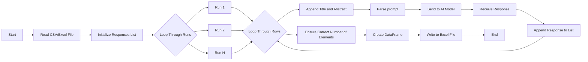

# AI Assisted Analysis Tool


This project is an open-source, locally run AI-assisted text analysis tool powered by Ollama. It now supports two distinct workflows:

## 1. Custom Analysis Workflow (NEW)

**Purpose:** Analyze any tabular data (Excel or CSV) using AI, not limited to abstracts. This workflow is flexible and user-friendly, allowing you to select which columns to analyze and how the results are reported.

**Key Features:**
- Works with any Excel or CSV file (not just abstracts)
- Lists all columns and lets you select identifier and content columns by name
- Lets you define what you want the AI to identify in your data (custom prompt)
- Allows you to set the number of analysis runs for each row
- Optionally aggregates AI responses for consensus and confidence
- Optionally appends all reporting info (prompt, runs, hardware, consensus summary, etc.) to the bottom of the Excel output file
- Enhanced reporting: includes prompt, number of runs, analysis duration, CPU/GPU info
- Cross-platform: Windows, macOS, Linux

**How to Use:**
1. Prepare your Excel or CSV file and place it in your chosen data input folder.
2. Make sure you also have a data output folder for your file to be saved in after the analysis.
3. Run the script:
   ```
   python ai_assisted_analysis.py
   ```
4. Follow the prompts:
   - Select the AI model (or press Enter for the recommended model)
   - Enter what you want the program to identify in your data (custom prompt)
   - Choose columns for identifier and content by name
   - Set the number of runs for analysis
   - Optionally aggregate AI responses for consensus and confidence
   - Optionally append all reporting info to the bottom of the output Excel file
5. Review your results in the output Excel file (includes consensus columns and reporting info if selected)

## 2. Zotero Abstracts Workflow (ORIGINAL)

**Purpose:** Analyze bibliographic abstracts exported from Zotero. This workflow is designed for users working specifically with Zotero data and abstracts.

**Key Features:**
- Designed for Zotero exports (CSV/Excel) containing bibliographic abstracts
- Uses replication and consensus-based approach to improve reliability
- Maintains local control of data for privacy and compliance
- Open-source and reproducible

**How to Use:**
1. Export your collection from Zotero as a CSV or Excel file
2. Use the provided scripts (e.g., `methods.py`, `results.py`, `location.py`, `theory.py`, `n_themes.py`) in the `python_for_Zotero_abstracts` folder to run targeted analyses on your exported data
3. Follow the prompts in each script for results and consensus aggregation
4. Review your results in the output Excel file

---

## Key Features

## Requirements

## Requirements
- **Python 3.7+** with virtual environment support
- **Ollama** - AI model runtime
  - [Ollama for Windows](https://ollama.com/download/windows)
  - [Ollama for Mac](https://ollama.com/download/mac)
  - [Ollama for Linux](https://ollama.com/download/linux)
- **Python Packages** (automatically installed via requirements.txt):
  - `ollama` - Python client for Ollama
  - `pandas` - Data manipulation and analysis
  - `tqdm` - Progress bars
  - `openpyxl` - Excel file handling
- Requires you to download or "pull" a model from Ollama to run the analysis. The examples code here all use Gemma2:9b.


## Prompts (Zotero Abstracts Workflow)

The following scripts in `python_for_Zotero_abstracts` are designed for specific types of analysis:

- `theory.py`: Identify urban planning theory used in abstracts
- `n_themes.py`: Identify three themes from abstracts
- `methods.py`: Identify methods used in abstracts
- `results.py`: Identify results from abstracts
- `location.py`: Identify where the research was conducted

Each script will prompt you for the required input and provide results in the output Excel file.

## How to Use


### Custom Analysis Workflow (custom_analysis.py)

1. **Prepare Your Data**: Place your CSV or Excel file in the data input folder.
2. **Run the Script**:
   ```
   python other_analysis/custom_analysis.py
   ```
3. **Follow Prompts**:
   - Select the model to use (or press Enter for the recommended model).
   - Define what you want the program to identify within the text.
   - Choose columns for identifier and content by name.
   - Set the number of runs for analysis.
4. **Consensus & Reporting**:
   - Optionally aggregate AI responses for consensus and confidence.
   - Optionally append all reporting info to the bottom of the output Excel file.
5. **Review Output**:
   - Results are saved to an Excel file in the specified output folder.
   - Consensus columns and reporting info are included if selected.

### Zotero Abstracts Workflow (original)

The workflow for analyzing Zotero abstracts and bibliographies remains unchanged. Export your collection from Zotero as a CSV or Excel file and use the provided scripts (e.g., `methods.py`, `results.py`, `location.py`, `theory.py`, `n_themes.py`) to run targeted analyses on your exported data. Follow the prompts in each script for results and consensus aggregation as before.

## Flow Diagram



## Directions

1. **Navigate to the parent directory**:
    ```sh
    cd /path/to/your/directory
    ```

2. **Create the virtual environment**:
    ```sh
    python -m venv venv
    ```

3. **Activate the virtual environment**:
    - On Windows:
        ```sh
        .\venv\Scripts\activate
        ```
    - On macOS/Linux:
        ```sh
        source venv/bin/activate
        ```

4. **Install Requirements**:
    ```sh
    pip install -r requirements.txt
    ```

5. **Install Chosen LLM**:
    ```sh    ollama pull gemma2
    ```

## Troubleshooting

### Import Errors
If you encounter import errors for `ollama`, `pandas`, or `tqdm`, ensure that:

1. **Virtual environment is activated**: Make sure you've activated your virtual environment before installing packages or running scripts.
2. **Correct package installation**: Run `pip install -r requirements.txt` in your activated virtual environment.
3. **VS Code Python interpreter**: If using VS Code, ensure it's using the Python interpreter from your virtual environment:
   - Open Command Palette (Ctrl+Shift+P)
   - Type "Python: Select Interpreter"
   - Choose the interpreter from your `venv` folder

### Common Package Issues
- **ollama package**: The correct package name is `ollama`, not `ollama_python`
- **Excel support**: `openpyxl` is required for writing Excel files with pandas
- **Progress bars**: `tqdm` provides the progress bars shown during analysis

### Virtual Environment Issues on Windows
If you encounter PowerShell execution policy errors when activating the virtual environment:
```powershell
# Use the batch file instead
.\venv\Scripts\activate.bat

# Or bypass execution policy temporarily
powershell -ExecutionPolicy Bypass -File .\venv\Scripts\Activate.ps1
```

## Cloning the Repository

1. **Open a terminal or command prompt**.
2. **Navigate to the directory where you want to clone the repository**:
    ```sh
    cd /path/to/your/directory
    ```
3. **Clone the repository**:
    ```sh
    git clone https://github.com/hleve/AI_Analysis_Tool.git
    ```
4. **Navigate to the cloned repository directory**:
    ```sh
    cd AI_Analysis_Tool
    ```

## Running a Python File

1. **Ensure the virtual environment is activated**:
    - On Windows:
        ```sh
        .\venv\Scripts\activate
        ```
    - On macOS/Linux:
        ```sh
        source venv/bin/activate
        ```

2. **Run the desired Python file**:
    ```sh
    python <filename>.py
    ```
    Replace `<filename>` with the name of the Python file you want to run. For example, to run `custom_analysis.py`, use:
    ```sh
    python custom_analysis.py
    ```

3. **Follow any additional prompts or instructions** provided by the script to complete the analysis.
