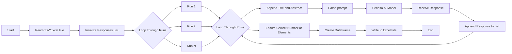

# AI Assisted Analysis Tool

This project is an open-source, locally run AI-assisted text analysis tool powered by Ollama. The tool is currently set up to to run AI-assisted analysis on an entire bibliography exported from Zotero. Users who want to use this tool should have Zotero installed and export a collection they want to perform the AI analysis on as a .csv file.

This tool is based on [Ollama](https://github.com/ollama/ollama-python) and is structured to work with bibliographic data exported from [Zotero](https://www.zotero.org/) to query abstracts. This code can also be used to query other types of data in .csv or .xls format using the `custom_analysis.py` file.

## Key Features
- Designed to work with Zotero exports (CSV/Excel).
- Uses replication to mitigate potential errors with a consensus-based approach.
- Maintains local control of data to ensure compliance with data-handling requirements.
- Provides an open-source, reproducible method for analysis.

## Requirements
- Requires Ollama
  - [Ollama for Windows](https://ollama.com/download/windows)
  - [Ollama for Mac](https://ollama.com/download/mac)
  - [Ollama for Linux](https://ollama.com/download/linux).
- Requires you to download or "pull" a model from Ollama to run the analysis. The examples code here all use Gemma2.

## Prompts

### Identify Urban Planning Theory
Provide the text of an abstract. The tool will identify the urban planning theory used in the abstract. If no urban planning theory was used, it will say "none."

### Identify Themes
Provide the text of an abstract. The tool will identify three themes from the abstract.

### Identify Methods
Provide the text of an abstract. The tool will identify the methods used in the abstract.

### Identify Results
Provide the text of an abstract. The tool will identify the results from the abstract.

### Identify Location
Provide the text of an abstract. The tool will identify where the research was conducted. If no location is mentioned, it will say "none."

## How to Use

1. **Export from Zotero**: Export the collection you want to analyze from Zotero as a CSV or Excel file.
2. **Run the Python files**: Use the provided Python code to run a specific AI analysis on the exported file (e.g., methods, results, location).
3. **Analyze Results**: The tool will process each item in the bibliography, using Ollama to extract specific data from the bibliographic items. The code uses replication to account for any potential errors, employing a consensus-based approach to pull data from the bibliographic items.
4. **Aggregate AI Results for Consensus**: Run the `ai_response_aggregation.py` file to aggregate the AI responses and get the result of the consensus and a rating for how strong the consensus is.

## Flow Diagram



## Directions

1. **Navigate to the parent directory**:
    ```sh
    cd /path/to/your/directory
    ```

2. **Create the virtual environment**:
    ```sh
    python -m venv venv
    ```

3. **Activate the virtual environment**:
    - On Windows:
        ```sh
        .\venv\Scripts\activate
        ```
    - On macOS/Linux:
        ```sh
        source venv/bin/activate
        ```

4. **Install Requirements**:
    ```sh
    pip install -r requirements.txt
    ```

5. **Install Chosen LLM**:
    ```sh
    ollama pull gemma2
    ```

## Cloning the Repository

1. **Open a terminal or command prompt**.
2. **Navigate to the directory where you want to clone the repository**:
    ```sh
    cd /path/to/your/directory
    ```
3. **Clone the repository**:
    ```sh
    git clone https://github.com/hleve/AI_Analysis_Tool.git
    ```
4. **Navigate to the cloned repository directory**:
    ```sh
    cd AI_Analysis_Tool
    ```

## Running a Python File

1. **Ensure the virtual environment is activated**:
    - On Windows:
        ```sh
        .\venv\Scripts\activate
        ```
    - On macOS/Linux:
        ```sh
        source venv/bin/activate
        ```

2. **Run the desired Python file**:
    ```sh
    python <filename>.py
    ```
    Replace `<filename>` with the name of the Python file you want to run. For example, to run `custom_analysis.py`, use:
    ```sh
    python custom_analysis.py
    ```

3. **Follow any additional prompts or instructions** provided by the script to complete the analysis.
