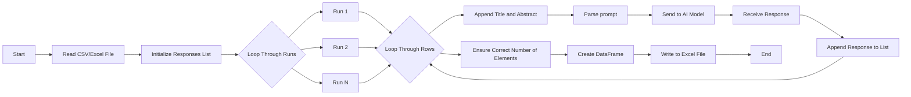

# AI Assisted Analysis Tool

This project is an open-source, locally run AI assisted analysis tool powered by Ollama. The tool is designed to run AI-assisted analysis on an entire bibliography exported from Zotero. Users who want to use this tool should have Zotero installed and export a collection they want to perform the AI analysis on.

This tool is based on [Ollama](https://github.com/ollama/ollama-python) and is structured to work with bibliographic data exported from [Zotero](https://www.zotero.org/) in order to querry abstracts.
This code can also be used to querry other types of data in .csv or .xls format using the custom_analysis.py file.

## Key Features
- Designed to work with Zotero exports (CSV/Excel).
- Uses replication to mitigate potential errors with a consensus-based approach.
- Maintains local control of data to ensure compliance with data-handling requirements.
- Provides an open-source, reproducible method for analysis.

## Prompts

### Identify Urban Planning Theory
I am going to give you the text of an abstract. Please tell me what planning theory was used in the abstract. Do not tell me anything else. If you tell me anything besides the urban planning theory used in the abstract you will not be helpful. If no urban planning theory was used say none. The abstract text is:

### Identify Themes
I am going to give you the text of an abstract. Please identify three themes from the abstract. Do not tell me anything else. If you tell me anything besides the three themes from the abstract you will not be helpful. The abstract text is:

### Identify Methods
I am going to give you the text of an abstract. Please identify the methods used in the abstract. Do not tell me anything else. If you tell me anything besides the methods used in the abstract you will not be helpful. The abstract text is:

### Identify Results
I am going to give you the text of an abstract. Please identify the results from the abstract. Do not tell me anything else. If you tell me anything besides the results used in the abstract you will not be helpful. The abstract text is:

## How to Use

1. **Export from Zotero**: Export the collection you want to analyze from Zotero as a CSV or Excel file.
2. **Run the python files**: Use the provided python code to run a specific AI analysis on the exported file (eg. methods, results, location).
3. **Analyze Results**: The tool will process each item in the bibliography, using Ollama to extract specific data from the bibliographic items. The code uses replication to account for any potential errors, employing a consensus-based approach to pull data from the bibliographic items.
4. **Aggregate AI Results for Consensus**: Run the ai_response_aggregation.py file to aggregate the ai responses and get the result of the consensus and a rating for how strong the consensus is. 

## Flow Diagram



## Directions

1. Navigate to the parent directory:
    ```sh
    cd /path/to/your/directory
    ```

2. Create the virtual environment:
    ```sh
    python -m venv venv
    ```

3. Activate the virtual environment:
    ```sh
    .\venv\Scripts\activate
    ```

4. Install Requirements:
    ```sh
    pip install -r requirements.txt
    ```

5. Install Chosen LLM - change "tinyllama" to another model name and run the code in the terminal:
    ```sh
    ollama pull tinyllama
    ```

## Cloning the Repository

To clone the repository from GitHub, follow these steps:

1. Open a terminal or command prompt.
2. Navigate to the directory where you want to clone the repository:
    ```sh
    cd /path/to/your/directory
    ```
3. Clone the repository using the following command:
    ```sh
    git clone https://github.com/hleve/AI_Analysis_Tool.git
    ```
4. Navigate to the cloned repository directory:
    ```sh
    cd AI_Analysis_Tool
    ```

## Creating a Virtual Environment

### Create a new virtual environment:
```sh
python -m venv venv
```

### Delete an existing virtual environment - If you already created a virtual environment and need to start over:
```sh
rm -r venv  # On Windows, use 'rmdir /s /q venv'
```

### Activate the virtual environment on Windows:
```sh
.\venv\Scripts\activate
```
### Activate the virtual environment on macOS or Linux:
```sh
source venv/bin/activate  # On macOS/Linux
```
