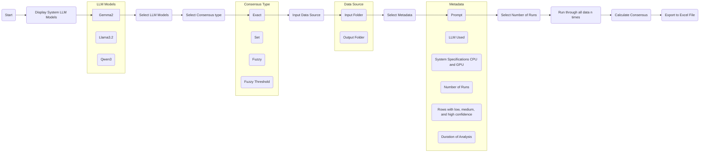

# AI Assisted Analysis Tool

## Introduction

AI Assisted Analysis Tool is an open-source, locally-run toolkit for AI-assisted text and image analysis based on Ollama. It supports three main workflows (text, image, Zotero abstracts) and is designed for reproducible, researcher-friendly analyses. The code allows researchers to run large text based datasets, image datasets, or abstracts exported from Zotero, and run flexible AI enabled analysis on each item. The code logic supports using any LLM from Ollama, and uses a strategy of multiple runs of each item through the LLM that are then consolidated through three main consensus modes to give the modal response across runs to account for LLM errors or hallucinations, with a confidence score based on the percentage of modal responces to total responses. The code optionally supports running through multiple LLM models on the same dataset and allows comparison and consensus calculation within and between models.

See the License and Citation sections for more details: [License](#license) · [Citation](#citation).

## Table of contents

- [Text Analysis Workflow](#text-analysis-workflow)
- [Image Analysis Workflow](#image-analysis-workflow)
- [Zotero Abstracts Workflow](#zotero-abstracts-workflow)
- [Usage patterns](#usage-patterns)
- [Requirements](#requirements)
- [Getting started](#getting-started)
- [Contributing](#contributing)
- [License & Citation](#license--citation)

## Key Points
- Supported inputs: Excel, CSV, image folders, and Zotero exports.
- Command-line usage: scripts also accept standard CLI arguments (example flags: --config, --models, --runs, --within-model-consensus, --between-model-consensus, --output). Command-line arguments override config file values.
- Defaults and precedence: built-in defaults → config file → explicit CLI arguments.
- Configuration: analysis scripts accept YAML or JSON config files (e.g., configs/text_analysis.yaml or configs/image_analysis.json).

### Quick examples:
- Use a YAML config:
    ```sh
    python text_analysis.py --config configs/text_analysis.yaml
    ```
- Use a JSON config and override runs on the CLI:
    ```sh
    python image_analysis.py --config configs/image_analysis.json --runs 3
    ```

### Why use configs and CLI options:
- Reproducibility: store full run settings in a config file for later reference.
- Automation: enable batch runs or CI by supplying a single config file.
- Flexibility: tweak individual settings on the fly via CLI without editing files.

See the usage sections for each workflow for full lists of accepted config keys and CLI flags (Text Analysis, Image Analysis, Zotero Abstracts). For reporting, outputs include Excel files with optional embedded metadata and a metadata sheet documenting prompt, model, runs, duration, and environment.


## Process flowchart


```mermaid
graph LR
    A --> B
    B --> C1
    C1 --> C
    C --> D
    D --> D1
    D1 --> E
    E --> E1
    E1 --> F
    F --> F1
    F1 --> G
    G --> H
    H --> I
    I --> J


    subgraph "LLM Models"
        C1[Gemma2]
        C2(Llama3.2)
        C3(Qwen3)
    end


    subgraph "Consensus Type"
        D1(Exact)
        D2(Set)
        D3(Fuzzy)
        D4(Fuzzy Threshold)
    end


    subgraph "Data Source"
        E1(Input Folder)
        E2(Output Folder)
    end


    subgraph "Metadata"
        F1(Prompt)
        F2(LLM Used)
        F3(System Specifications CPU and GPU)
        F4(Number of Runs)
        F5(Rows with low, medium, and high confidence)
        F6(Duration of Analysis)
    end


    A(Start)
    B(Display System LLM Models)
    C(Select LLM Models)
    D(Select Consensus type)
    E(Input Data Source)
    F(Select Metadata)
    G(Select Number of Runs)
    H(Run through all data n times)
    I(Calculate Consensus)
    J(Export to Excel File)
```

## Text Analysis Workflow

Purpose: analyze tabular data (Excel or CSV) using an LLM. Typical uses include extracting codes, identifying themes, or summarising text columns.

Key features:

- Works with Excel and CSV files.
- Lets you select identifier and content columns by name.
- Custom prompts and configurable number of runs per row.
- Optional within-model consensus and confidence scoring.
- Optionally append reporting metadata to the output Excel file.

How to use (interactive):

1. Prepare your Excel/CSV input and an output folder.
2. Run:

```powershell
python text_analysis.py
```

3. Follow prompts to select model, columns, runs, and other settings.

How to use (non-interactive):

```powershell
python text_analysis.py --config configs/text_config_example.yaml --no-interactive
```

## Image Analysis Workflow

Purpose: analyze images using local vision-capable models and compute consensus across runs and/or models.

Key features:

- Run one or more vision models sequentially.
- Multiple replicates per image produce Response_1..N columns.
- Within-model Consensus and Consensus_Confidence modes: `exact`, `set`, `fuzzy`.
- `fuzzy` uses `rapidfuzz` to cluster similar responses (optional dependency).
- Progress bars and optional `switch_delay` between models.

How to use (example):

1. Prepare an input folder with images and an output folder.
2. Ensure a vision-capable model is available in Ollama (example):

```powershell
ollama pull gemma3:12b
```

3. Run interactively:

```powershell
python image_analysis.py
```

For fuzzy consensus, install `rapidfuzz`:

```powershell
pip install rapidfuzz
```

## Zotero Abstracts Workflow

Purpose: targeted analyses of bibliographic abstracts exported from Zotero. The `python_for_Zotero_abstracts` folder contains scripts for common tasks.

Common scripts:

- `theory.py` — identify theories mentioned in abstracts.
- `n_themes.py` — identify themes.
- `methods.py` — identify methods.
- `results.py` — extract reported results.
- `location.py` — identify geographic or contextual location.

Workflow:

1. Export your Zotero collection as CSV or Excel.
2. Run the appropriate script in `python_for_Zotero_abstracts` and follow prompts or provide a config.

## Usage patterns

Run modes:

- Interactive: omit `--config`/`--no-interactive` and respond to prompts.
- CLI-only (non-interactive): provide all settings and use `--no-interactive`.
- Config-driven: provide `--config <file>` (YAML/JSON) and optionally override via CLI.

Mutually-exclusive boolean flags

The scripts use explicit on/off flags so a missing flag doesn't accidentally change config values. The tri-state flags are:

- Within-model consensus: `--within-model-consensus` / `--no-within-model-consensus` (defaults to ON when not specified).
- Between-model consensus: `--between-model-consensus` / `--no-between-model-consensus` (defaults to ON when not specified).
- Append metadata: `--append-metadata` / `--no-append-metadata` (defaults to ON when not specified).

Specifying `--within-model-consensus` forces it on; `--no-within-model-consensus` forces it off. Omitting both uses the config file or script default.

Examples:

```powershell
python text_analysis.py
python image_analysis.py --models "gemma3:12b" --input "./images" --output "results.xlsx" --runs 2 --within-model-consensus --within-model-consensus-mode fuzzy --within-model-fuzzy-threshold 85 --no-interactive
python text_analysis.py --config configs/text_config_example.yaml --no-interactive
```

## Requirements

- Python 3.10+ recommended.
- Dependencies: install from `requirements.txt`:

```powershell
pip install -r requirements.txt
```

- `ollama` (local runtime) — see https://ollama.com/download for platform installers.
- Optional: `rapidfuzz` for fuzzy consensus (install via `pip install rapidfuzz` or included in `requirements.txt`).

## Getting started

See `documentation.md` for a step-by-step guide and example configs in the repo (`image_config_example.yaml`, `text_config_example.yaml`).

## Contributing

Contributions are welcome. See `CONTRIBUTING.md` and `CODE_OF_CONDUCT.md` for guidelines.

## License & Citation

See `LICENSE` for license terms. If you use this software (or parts of it) in a publication, please cite this project using the metadata in `CITATION.cff`.

Example (APA):

Levesque, H. (2025). AI_Assisted_Analysis_Tool (version 1.2-beta) [Software]. Zenodo. https://doi.org/10.5281/zenodo.14932653

BibTeX example:

```bibtex
@software{levesque_ai_2025,
    author = {Levesque, Henry},
    title = {AI_Assisted_Analysis_Tool},
    year = {2025},
    version = {1.2-beta},
    doi = {10.5281/zenodo.14932653},
    url = {https://github.com/henrylevesque/AI_Analysis_Tool}
}
```