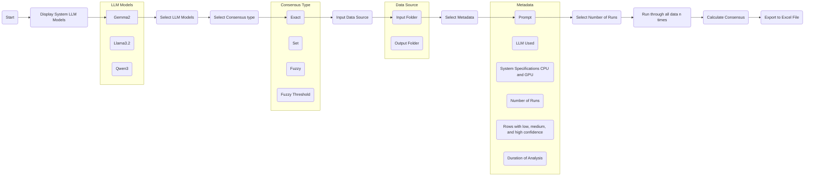

# AI Assisted Analysis Tool

## Introduction

AI Assisted Analysis Tool is an open-source, locally-run toolkit for AI-assisted text and image analysis based on Ollama. It supports three main workflows (text, image, Zotero abstracts) and is designed for reproducible, researcher-friendly analyses. The code allows researchers to run large text based datasets, image datasets, or abstracts exported from Zotero, and run flexible AI enabled analysis on each item. The code logic supports using any LLM from Ollama, and uses a strategy of multiple runs of each item through the LLM that are then consolidated through three main consensus modes to give the modal response across runs to account for LLM errors or hallucinations, with a confidence score based on the percentage of modal responces to total responses. The code optionally supports running through multiple LLM models on the same dataset and allows comparison and consensus calculation within and between models.

See the License and Citation sections for more details: [License](LICENSE) · [Citation](CITATION.cff).

## Table of contents

- [Text Analysis Workflow](#text-analysis-workflow)
- [Image Analysis Workflow](#image-analysis-workflow)
- [Zotero Abstracts Workflow](#zotero-abstracts-workflow)
- [Usage patterns](#usage-patterns)
- [Requirements](#requirements)
- [Getting started](#getting-started)
- [Contributing](#contributing)
- [License & Citation](#license--citation)

## Key Points
- Supported inputs: Excel, CSV, image folders, and Zotero exports.
- Command-line usage: scripts also accept standard CLI arguments (example flags: --config, --models, --runs, --within-model-consensus, --between-model-consensus, --output). Command-line arguments override config file values.
- Defaults and precedence: built-in defaults → config file → explicit CLI arguments.
- Configuration: analysis scripts accept YAML or JSON config files (e.g., configs/text_analysis.yaml or configs/image_analysis.json).

### Quick examples:
- Use a YAML config:
    ```sh
    python text_analysis.py --config configs/text_analysis.yaml
    ```
- Use a JSON config and override runs on the CLI:
    ```sh
    python image_analysis.py --config configs/image_analysis.json --runs 3
    ```

### Why use configs and CLI options:
- Reproducibility: store full run settings in a config file for later reference.
- Automation: enable batch runs or CI by supplying a single config file.
- Flexibility: tweak individual settings on the fly via CLI without editing files.

See the usage sections for each workflow for full lists of accepted config keys and CLI flags (Text Analysis, Image Analysis, Zotero Abstracts). For reporting, outputs include Excel files with optional embedded metadata and a metadata sheet documenting prompt, model, runs, duration, and environment.


## Process flowchart


```mermaid
graph LR
    A --> B
    B --> C1
    C1 --> C
    C --> D
    D --> D1
    D1 --> E
    E --> E1
    E1 --> F
    F --> F1
    F1 --> G
    G --> H
    H --> I
    I --> J


    subgraph "LLM Models"
        C1[Gemma2]
        C2(Llama3.2)
        C3(Qwen3)
    end


    subgraph "Consensus Type"
        D1(Exact)
        D2(Set)
        D3(Fuzzy)
        D4(Fuzzy Threshold)
    end


    subgraph "Data Source"
        E1(Input Folder)
        E2(Output Folder)
    end


    subgraph "Metadata"
        F1(Prompt)
        F2(LLM Used)
        F3(System Specifications CPU and GPU)
        F4(Number of Runs)
        F5(Rows with low, medium, and high confidence)
        F6(Duration of Analysis)
    end


    A(Start)
    B(Display System LLM Models)
    C(Select LLM Models)
    D(Select Consensus type)
    E(Input Data Source)
    F(Select Metadata)
    G(Select Number of Runs)
    H(Run through all data n times)
    I(Calculate Consensus)
    J(Export to Excel File)
```

## Text Analysis Workflow

Purpose: analyze tabular data (Excel or CSV) using an LLM. Typical uses include extracting codes, identifying themes, or summarising text columns.

Key features:

- Works with Excel and CSV files (single file or folder of files).
- Lets you select identifier and content columns by name.
- Custom prompts and configurable number of runs per row.
- Optional within-model consensus and confidence scoring.
- Flexible output: specify output file, folder, or use same location as input.
- Optionally append reporting metadata to the output Excel file.

### How to use (Interactive)

```powershell
python text_analysis.py
```
Then follow prompts to:
1. Select model(s)
2. Provide input file or folder path
3. Specify output location (optional; defaults to input folder)
4. Choose identifier and content columns
5. Set number of runs and consensus options

### How to use (Config-based, recommended for reproducibility)

1. **Create a config file** (see [text_config_example.yaml](text_config_example.yaml) or [text_config_example.json](text_config_example.json) for templates):

```yaml
models: ['gemma3:12b']
prompt_desc: "Main topic"
input: "./data/abstracts.xlsx"
output: "./data/results.xlsx"
id_col: "id"
content_col: "abstract"
runs: 5
within_model_consensus: true
within_model_consensus_mode: fuzzy
within_model_fuzzy_threshold: 85
append_metadata: true
```

2. **Run non-interactively** with the config:

```powershell
python text_analysis.py --config text_config_example.yaml --no-interactive
```

3. **Or run interactively** and confirm using the config:

```powershell
python text_analysis.py --config text_config_example.yaml
```
The script will ask: "Load configuration from text_config_example.yaml? (y/n) [y]:"

### Input and Output Paths

- **input**: Can be:
  - A direct file path: `./data/abstracts.xlsx` 
  - A folder path: `./data/` (script finds first CSV/XLSX file)
  - Default (interactive): `.` (current directory)

- **output**: Can be:
  - A direct file path: `./results.xlsx` (fixed output name)
  - A folder path: `./output_folder/` (auto-generates filename)
  - Not specified (defaults to input folder with auto-generated filename)

### CLI Examples

```powershell
# Interactive with default settings
python text_analysis.py

# Config-based (non-interactive, most reproducible)
python text_analysis.py --config text_config_example.yaml --no-interactive

# Config-based (interactive, confirm before running)
python text_analysis.py --config text_config_example.yaml

# Override config settings from CLI
python text_analysis.py --config text_config_example.yaml --runs 3 --within-model-consensus-mode fuzzy

# CLI-only (no config file)
python text_analysis.py --input "./data/abstracts.xlsx" --output "./results.xlsx" --id-col "id" --content-col "text" --runs 2 --no-interactive
```

## Image Analysis Workflow

Purpose: analyze images using local vision-capable models and compute consensus across runs and/or models.

Key features:

- Works with individual image files or folders of images (supports JPG, PNG, BMP, TIFF, GIF, WebP).
- Multiple replicates per image produce Response_1..N columns.
- Within-model Consensus and Consensus_Confidence modes: `exact`, `set`, `fuzzy`.
- `fuzzy` uses `rapidfuzz` to cluster similar responses (optional dependency).
- Flexible output: specify output file, folder, or use same location as input.
- Progress bars and optional `switch_delay` between models.

### How to use (Interactive)

```powershell
python image_analysis.py
```
Then follow prompts to:
1. Select vision model(s)
2. Provide input image file or folder path
3. Specify output location (optional; defaults to input folder)
4. Specify what to identify in images
5. Set number of runs and consensus options

### How to use (Config-based, recommended for reproducibility)

1. **Create a config file** (see [image_config_example.yaml](image_config_example.yaml) or [image_config_example.json](image_config_example.json) for templates):

```yaml
models: ['gemma3:12b', 'llava:13b']
type_of_analysis: "objects and materials"
input: "./data/images/"
output: "./data/image_results/"
runs: 5
within_model_consensus: true
within_model_consensus_mode: fuzzy
within_model_fuzzy_threshold: 85
between_model_consensus: true
between_model_consensus_mode: exact
between_model_fuzzy_threshold: 85
aggregate: false
append_metadata: true
```

2. **Run non-interactively** with the config:

```powershell
python image_analysis.py --config image_config_example.yaml --no-interactive
```

3. **Or run interactively** and confirm using the config:

```powershell
python image_analysis.py --config image_config_example.yaml
```

### Input and Output Paths

- **input**: Can be:
  - A direct image file path: `./data/building.jpg`
  - A folder path: `./data/images/` (analyzes all images in folder)
  - Default (interactive): prompts for path

- **output**: Can be:
  - A direct file path: `./results.xlsx` (fixed output name)
  - A folder path: `./output_folder/` (auto-generates filename)
  - Not specified (defaults to input folder with auto-generated filename)

### CLI Examples

```powershell
# Interactive with default settings
python image_analysis.py

# Config-based (non-interactive, most reproducible)
python image_analysis.py --config image_config_example.yaml --no-interactive

# Config-based (interactive, confirm before running)
python image_analysis.py --config image_config_example.yaml

# Override config settings from CLI
python image_analysis.py --config image_config_example.yaml --runs 3 --aggregate

# CLI-only (no config file, single image)
python image_analysis.py --input "./images/photo.jpg" --output "./results.xlsx" --type-of-analysis "objects" --runs 2 --no-interactive

# CLI-only (no config file, folder of images)
python image_analysis.py --input "./images/" --models "gemma3:12b,llava:13b" --runs 3 --between-model-consensus --no-interactive
```

For fuzzy consensus modes, install `rapidfuzz`:

```powershell
pip install rapidfuzz
```

## Zotero Abstracts Workflow

Zotero-specific scripts have been removed from this repository.

## Usage patterns

Run modes:

- Interactive: omit `--config`/`--no-interactive` and respond to prompts.
- CLI-only (non-interactive): provide all settings and use `--no-interactive`.
- Config-driven: provide `--config <file>` (YAML/JSON) and optionally override via CLI.

Tri-state boolean flags

The scripts use explicit on/off flags so a missing flag doesn't accidentally change config values. These flags are:

- Within-model consensus: `--within-model-consensus` / `--no-within-model-consensus` (defaults to ON when not specified).
- Between-model consensus: `--between-model-consensus` / `--no-between-model-consensus` (defaults to ON when not specified).
- Aggregated consensus: `--aggregate` / `--no-aggregate` (defaults to OFF when not specified).
- Append metadata: `--append-metadata` / `--no-append-metadata` (defaults to ON when not specified).

Specifying `--within-model-consensus` forces it on; `--no-within-model-consensus` forces it off. Omitting both uses the config file or script default.

### Three Types of Consensus

The tool supports three independent consensus calculations to account for LLM variability:

1. **Within-Model Consensus**: Computed across multiple runs of the same model on the same item
   - Applied to `Response_1`, `Response_2`, etc. columns for each model
   - Produces `Consensus (ModelName)` and `Consensus_Confidence (ModelName)` columns
   - Defaults to ON; automatically OFF if only one run per item
   - Modes: `exact` (text must match), `set` (treat responses as unordered lists), `fuzzy` (similarity-based grouping)

2. **Between-Model Consensus**: Computed across per-model consensus results when multiple models are used
   - Applied to `Consensus (Model1)`, `Consensus (Model2)`, etc. columns
   - Produces `BetweenModel_Consensus` and `BetweenModel_Consensus_Confidence` columns
   - Only applies if 2+ models are used; defaults to ON
   - Modes: `exact`, `set`, `fuzzy` (configurable independently from within-model)

3. **Aggregated Consensus**: Computed across ALL response columns regardless of model
   - Applied directly to all `Response_X (Model)` columns
   - Produces `Aggregated_Consensus` and `Aggregated_Consensus_Confidence` columns
   - Independent from between-model consensus; defaults to OFF
   - Useful for single-model + multiple-run analysis or treating all responses equally
   - Modes: `exact`, `set`, `fuzzy` (configurable independently)

Examples:

```powershell
# Interactive mode (prompts for all settings)
python text_analysis.py

# Config-driven non-interactive mode (all settings from file)
python text_analysis.py --config configs/text_config_example.yaml --no-interactive

# Config with CLI overrides (config provides defaults, CLI overrides specific settings)
python image_analysis.py --config configs/image_config_example.yaml --runs 5 --aggregate

# CLI-only (no config, specify all settings on command line)
python image_analysis.py --models "gemma3:12b" --input "./images" --output "results.xlsx" --runs 2 --within-model-consensus --within-model-consensus-mode fuzzy --within-model-fuzzy-threshold 85 --no-interactive
```

### Config File Workflow

When using `--config <file>`:
1. In interactive mode, you're prompted to confirm using the config file before proceeding with analysis
2. In non-interactive mode (`--no-interactive`), the config settings are applied directly
3. Config values serve as defaults; CLI arguments override them
4. Missing settings in config fall back to built-in defaults

Config files support both YAML and JSON formats. Example config keys:
- `models`: Array of model names to run sequentially
- `runs`: Number of times to run each item through each model
- `within_model_consensus`: Boolean (true/false) 
- `within_model_consensus_mode`: One of 'exact', 'set', or 'fuzzy'
- `within_model_fuzzy_threshold`: Threshold 0-100 for fuzzy matching
- `between_model_consensus`: Boolean (only applies with 2+ models)
- `between_model_consensus_mode`: One of 'exact', 'set', or 'fuzzy'
- `between_model_fuzzy_threshold`: Threshold 0-100 for fuzzy matching
- `aggregate`: Boolean (independent aggregation across all responses)
- `aggregated_consensus_mode`: One of 'exact', 'set', or 'fuzzy' for aggregated results
- `aggregated_fuzzy_threshold`: Threshold 0-100 for aggregated fuzzy matching

## Common Workflows

### Workflow 1: Single File Analysis (Text)
Best for: Quick analysis of one Excel/CSV file
```powershell
# Create a minimal config
python text_analysis.py --config text_config_example.yaml --input "./my_data.xlsx" --output "./my_results.xlsx" --no-interactive
```

### Workflow 2: Batch Processing with Folder
Best for: Running the same analysis on multiple files in a folder
```powershell
# First file in folder will be auto-detected and analyzed
python text_analysis.py --config text_config_example.yaml --no-interactive
```

### Workflow 3: Reproducible Analysis with Config
Best for: Documenting exactly how an analysis was performed
```powershell
# 1. Create and version-control your config file in your project
# 2. Run the analysis
python text_analysis.py --config ./configs/my_analysis.yaml --no-interactive

# Later, you can reproduce the exact same analysis by running the same command
```

### Workflow 4: Model Comparison
Best for: Comparing responses across multiple models
```yaml
# Create config with multiple models
models:
  - gemma3:12b
  - llama3.2:7b
between_model_consensus: true
between_model_consensus_mode: "fuzzy"
```
```powershell
python text_analysis.py --config comparison_config.yaml --no-interactive
```

### Workflow 5: Consensus Evaluation
Best for: Setting multiple consensus modes to compare results
```yaml
# Config with within-model fuzzy consensus
within_model_consensus: true
within_model_consensus_mode: "fuzzy"
within_model_fuzzy_threshold: 85

# Plus aggregated consensus across all runs
aggregate: true
aggregated_consensus_mode: "exact"
```
```powershell
python text_analysis.py --config consensus_config.yaml --no-interactive
```

### Workflow 6: Single Image Analysis
Best for: Quick analysis of one image
```powershell
python image_analysis.py --input "./photo.jpg" --output "./results.xlsx" --type-of-analysis "architectural features" --runs 3 --no-interactive
```

## Best Practices

1. **Use config files for reproducible analyses**: Config files document exactly what settings were used, making your work reproducible.

2. **Always use `--no-interactive` in scripts**: Use `--no-interactive` when running analyses from scripts or batch jobs to avoid hangs waiting for input.

3. **Test with small runs first**: Before running with `runs: 10+`, test with `runs: 1-2` to verify settings are correct.

4. **Monitor GPU memory**: If analyzing large images or many items, start with fewer runs to avoid GPU memory issues.

5. **Use fuzzy consensus carefully**: Fuzzy matching is flexible but can mask real differences. Always review the confidence scores.

6. **Specify output location explicitly**: Don't rely on defaults; specify `output` in your config to avoid surprises about where results are saved.

7. **Append metadata**: Always use `append_metadata: true` to document analysis conditions for later reference.

## Requirements

- Python 3.10+ recommended.
- Dependencies: install from `requirements.txt`:

```powershell
pip install -r requirements.txt
```

- `ollama` (local runtime) — see https://ollama.com/download for platform installers.
- Optional: `rapidfuzz` for fuzzy consensus (install via `pip install rapidfuzz` or included in `requirements.txt`).

## Getting started

See [documentation.md](documentation.md) for a step-by-step guide and example configs in the repo ([image_config_example.yaml](image_config_example.yaml), [text_config_example.yaml](text_config_example.yaml)).

## Contributing

Contributions are welcome. See [CONTRIBUTING.md](CONTRIBUTING.md) and [CODE_OF_CONDUCT.md](CODE_OF_CONDUCT.md) for guidelines.

## License & Citation

See [LICENSE](LICENSE) for license terms. If you use this software (or parts of it) in a publication, please cite this project using the metadata in [CITATION.cff](CITATION.cff).

Example (APA):

Levesque, H. (2025). AI_Assisted_Analysis_Tool (version 1.2-beta) [Software]. Zenodo. https://doi.org/10.5281/zenodo.14932653

BibTeX example:

```bibtex
@software{levesque_ai_2025,
    author = {Levesque, Henry},
    title = {AI_Assisted_Analysis_Tool},
    year = {2025},
    version = {1.2-beta},
    doi = {10.5281/zenodo.14932653},
    url = {https://github.com/henrylevesque/AI_Analysis_Tool}
}
```

# AI Assisted Analysis Tool - Quick Start

## Getting Started

1. **Clone the repository**
   ```powershell
   git clone https://github.com/hleve/AI_Assisted_Analysis_Tool.git
   ```

2. **Install dependencies**
   ```powershell
   pip install -r requirements.txt
   ```

3. **Run the main script**
   ```powershell
   python text_analysis.py
   ```

4. **Explore analysis modules**
   - `other_analysis/ai_response_aggregation.py`: Aggregates AI responses
   - `python_for_Zotero_abstracts/`: Contains thematic and methodological analysis scripts

Optional: if you use Ollama models locally, pull the default model:
```bash
ollama pull gemma2
```

For detailed technical documentation, configuration, and developer notes, see [documentation.md](documentation.md).