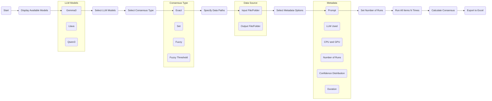

# AI Assisted Analysis Tool

## Introduction

AI Assisted Analysis Tool is an open-source, locally-run toolkit for AI-assisted text and image analysis using [Ollama](https://ollama.com). The tool runs any LLM available in Ollama, executing each item multiple times and consolidating results through three consensus modes to produce a modal response with a confidence score. It optionally runs multiple models on the same dataset and computes consensus within and between models.

See [License](LICENSE) · [Citation](CITATION.cff) · [Prompt Library](PROMPTS.md)

## Table of Contents

- [Text Analysis Workflow](#text-analysis-workflow)
- [Image Analysis Workflow](#image-analysis-workflow)
- [Usage Patterns](#usage-patterns)
- [Three Types of Consensus](#three-types-of-consensus)
- [Requirements](#requirements)
- [Getting Started](#getting-started)
- [Contributing](#contributing)
- [License & Citation](#license--citation)

## Key Points

- **Inputs**: Excel (.xlsx), CSV, image files/folders (JPG, PNG, BMP, TIFF, GIF, WebP).
- **LLM backend**: Ollama (local, no API key required, data stays on your machine).
- **Consensus modes**: `exact`, `set`, `fuzzy` (within-model, between-model, or across all responses).
- **CLI usage**: all settings can be supplied via `--flag` arguments or a YAML/JSON config file.
- **Precedence**: built-in defaults → config file → CLI arguments (CLI wins).
- **Reliability**: configurable timeout and automatic retry with exponential backoff.

### Quick examples

```sh
# Interactive (prompts for all settings)
python text_analysis.py

# Config-driven, fully reproducible
python text_analysis.py --config text_config_example.yaml --no-interactive

# Override config settings on the fly
python image_analysis.py --config image_config_example.yaml --runs 3
```

## Process Flowchart


```mermaid
graph LR
    A --> B
    B --> C1
    C1 --> C
    C --> D
    D --> D1
    D1 --> E
    E --> E1
    E1 --> F
    F --> F1
    F1 --> G
    G --> H
    H --> I
    I --> J

    subgraph "LLM Models"
        C1[Gemma3]
        C2(Llava)
        C3(Qwen3)
    end

    subgraph "Consensus Type"
        D1(Exact)
        D2(Set)
        D3(Fuzzy)
        D4(Fuzzy Threshold)
    end

    subgraph "Data Source"
        E1(Input File/Folder)
        E2(Output File/Folder)
    end

    subgraph "Metadata"
        F1(Prompt)
        F2(LLM Used)
        F3(CPU and GPU)
        F4(Number of Runs)
        F5(Confidence Distribution)
        F6(Duration)
    end

    A(Start)
    B(Display Available Models)
    C(Select LLM Models)
    D(Select Consensus Type)
    E(Specify Data Paths)
    F(Select Metadata Options)
    G(Set Number of Runs)
    H(Run All Items N Times)
    I(Calculate Consensus)
    J(Export to Excel)
```

---

## Text Analysis Workflow

Analyzes tabular data (Excel or CSV) using an LLM. Typical uses: extracting codes, identifying themes, classifying text, summarizing content.

**Key features:**
- Excel and CSV input (single file or auto-detect from folder).
- Identifier and content columns selected by name (case-insensitive).
- Custom prompt, configurable runs per row.
- Within-model consensus and confidence scoring.
- Optional between-model and aggregate consensus.
- Metadata appended to output workbook.

### Interactive

```powershell
python text_analysis.py
```

Prompts for: model(s), input path, output path, columns, run count, consensus options.

### Config-based (recommended for reproducibility)

1. Copy and edit [text_config_example.yaml](text_config_example.yaml):

```yaml
models:
  - gemma3:12b
prompt_desc: "the main topic or theme"
input: "./data/abstracts.xlsx"
output: "./data/results/"
id_col: "id"
content_col: "abstract"
runs: 5
within_model_consensus: true
within_model_consensus_mode: fuzzy
within_model_fuzzy_threshold: 85
append_metadata: true
```

2. Run:

```powershell
python text_analysis.py --config text_config_example.yaml --no-interactive
```

### CLI Examples

```powershell
# Basic single-model run
python text_analysis.py \
  --input ./data/abstracts.xlsx \
  --id-col id --content-col abstract \
  --runs 5 --models gemma3:12b \
  --no-interactive

# Multi-model comparison
python text_analysis.py \
  --models "gemma3:12b,deepseek-r1:14b" \
  --input ./data/abstracts.xlsx \
  --between-model-consensus \
  --runs 5 --no-interactive

# Config with CLI overrides
python text_analysis.py --config text_config_example.yaml --runs 3 --within-model-consensus-mode exact

# With custom timeout and retries (useful for slow hardware)
python text_analysis.py --config text_config_example.yaml --timeout 240 --retries 3 --no-interactive
```

### Input & Output Paths

| `input` | Behavior |
|---------|-----------|
| File path (`./data/file.xlsx`) | Analyzes that file |
| Folder path (`./data/`) | Auto-detects first CSV/XLSX |
| `.` (default interactive) | Uses current directory |

| `output` | Behavior |
|----------|-----------|
| File path (`./results.xlsx`) | Saves to that file |
| Folder path (`./results/`) | Auto-generates filename |
| Not specified | Saves alongside input file |

---

## Image Analysis Workflow

Analyzes images using local vision-capable models (llava, llama3.2-vision, qwen2.5vl, etc.).

**Key features:**
- Single image file or folder of images.
- Multiple runs per image for within-model consensus.
- Between-model and aggregate consensus supported.
- Progress bars for images and runs.

### Interactive

```powershell
python image_analysis.py
```

### Config-based

1. Copy and edit [image_config_example.yaml](image_config_example.yaml):

```yaml
models:
  - llava:13b
  - llama3.2-vision:11b
type_of_analysis: "objects and materials"
input: "./data/images/"
output: "./data/image_results/"
runs: 5
timeout: 180
within_model_consensus: true
within_model_consensus_mode: fuzzy
between_model_consensus: true
append_metadata: true
```

2. Run:

```powershell
python image_analysis.py --config image_config_example.yaml --no-interactive
```

### CLI Examples

```powershell
# Single image
python image_analysis.py \
  --input ./photo.jpg --output ./results.xlsx \
  --type-of-analysis "architectural features" \
  --runs 3 --no-interactive

# Folder of images, multi-model
python image_analysis.py \
  --input ./images/ \
  --models "llava:13b,llama3.2-vision:11b" \
  --runs 3 --between-model-consensus --no-interactive
```

For fuzzy consensus, install `rapidfuzz`:

```powershell
pip install rapidfuzz
```

---

## Usage Patterns

| Mode | When to use |
|------|-------------|
| **Interactive** | Exploring, one-off analyses, testing settings |
| **Config-driven + `--no-interactive`** | Documented, reproducible analyses |
| **CLI flags only** | Scripting, batch jobs |

### Tri-State Boolean Flags

These flags have three states so that omitting a flag does not accidentally override a config file value:

| Flag | Effect |
|------|--------|
| `--within-model-consensus` | Force ON |
| `--no-within-model-consensus` | Force OFF |
| *(omitted)* | Use config/default |

Same pattern for `--between-model-consensus`, `--aggregate`, and `--append-metadata`.

**Defaults when not specified:** within-model ON, between-model ON (only with 2+ models), aggregate OFF, append-metadata ON.

### All CLI Flags

```
--config, -c              Path to YAML or JSON config file
--models                  Comma-separated model names
--input                   Input file or folder path
--output                  Output file or folder path
--runs                    Number of runs per item
--timeout                 Ollama request timeout in seconds [120]
--retries                 Retry attempts on Ollama failure [2]
--delay                   Delay between model switches in seconds
--within-model-consensus / --no-within-model-consensus
--within-model-consensus-mode   exact | set | fuzzy
--within-model-fuzzy-threshold  0–100
--between-model-consensus / --no-between-model-consensus
--between-model-consensus-mode  exact | set | fuzzy
--between-model-fuzzy-threshold 0–100
--aggregate / --no-aggregate
--append-metadata / --no-append-metadata
--no-interactive          Suppress all prompts (requires all settings via config/CLI)
```

Text-only flags: `--id-col`, `--content-col`
Image-only flags: `--type-of-analysis`

---

## Three Types of Consensus

The tool computes three independent consensus types to account for LLM variability:

### 1. Within-Model Consensus
Computed across N runs of the same model on the same item.
- Input columns: `Response_1 (model)`, `Response_2 (model)`, ...
- Output columns: `Consensus (model)`, `Confidence (model)`
- Default: ON when runs > 1

### 2. Between-Model Consensus
Computed across per-model consensus results (requires 2+ models).
- Input columns: `Consensus (model1)`, `Consensus (model2)`, ...
- Output columns: `Between_Consensus`, `Between_Confidence`
- Default: ON when 2+ models are used

### 3. Aggregate Consensus
Computed across all response columns, regardless of model.
- Input columns: all `Response_X (model)` columns
- Output columns: `Aggregate_Consensus`, `Aggregate_Confidence`
- Default: OFF (useful for treating all runs uniformly)

### Consensus Modes

| Mode | Best for | Notes |
|------|----------|-------|
| `exact` | Short discrete labels (categories, sentiment) | Normalizes case and punctuation before comparing |
| `set` | Comma/semicolon-separated lists (themes, keywords) | Items appearing in >50% of runs are kept |
| `fuzzy` | Free-text that may be paraphrased | Requires `rapidfuzz`; threshold 80–90 recommended |

See [PROMPTS.md](PROMPTS.md) for a full prompt library and guidance on choosing a consensus mode.

---

## Common Workflows

### Single-model text analysis
```powershell
python text_analysis.py \
  --input ./data/abstracts.xlsx \
  --id-col id --content-col abstract \
  --runs 5 --models gemma3:12b \
  --within-model-consensus --within-model-consensus-mode fuzzy \
  --no-interactive
```

### Multi-model comparison
```yaml
# comparison_config.yaml
models:
  - gemma3:12b
  - deepseek-r1:14b
between_model_consensus: true
between_model_consensus_mode: fuzzy
runs: 5
```
```powershell
python text_analysis.py --config comparison_config.yaml --no-interactive
```

### Reproducible analysis (config-driven)
```powershell
# Store the config alongside your data; re-run anytime to reproduce results
python text_analysis.py --config ./study/analysis_config.yaml --no-interactive
```

---

## Best Practices

1. **Use config files** for any analysis you need to reproduce or document; store the config with your data.
2. **Always use `--no-interactive`** in scripts and batch jobs.
3. **Test with `--runs 1`** before committing to a full run.
4. **Check confidence scores**: rows below 40% confidence may need manual review.
5. **Use fuzzy mode thoughtfully**: it smooths variation but can mask real disagreement; review the threshold.
6. **Increase `--timeout`** for large models or slow hardware (default: 120s for text, recommend 180s+ for vision).

---

## Requirements

- Python 3.10+
- [Ollama](https://ollama.com/download) installed and running locally

```powershell
pip install -r requirements.txt
```

Optional (required only for fuzzy consensus mode):
```powershell
pip install rapidfuzz
```

---

## Getting Started

1. **Clone the repository**
   ```powershell
   git clone https://github.com/henrylevesque/AI_Assisted_Analysis_Tool.git
   cd AI_Assisted_Analysis_Tool
   ```

2. **Install dependencies**
   ```powershell
   pip install -r requirements.txt
   ```

3. **Pull a model in Ollama**
   ```powershell
   ollama pull gemma3:12b
   ```

4. **Run interactively**
   ```powershell
   python text_analysis.py
   ```

5. **Or copy an example config and run non-interactively**
   ```powershell
   copy text_config_example.yaml my_config.yaml
   # edit my_config.yaml for your data
   python text_analysis.py --config my_config.yaml --no-interactive
   ```

For a full prompt library and workflow examples, see [PROMPTS.md](PROMPTS.md).
For technical documentation, see [documentation.md](documentation.md).

---

## Contributing

Contributions are welcome. See [CONTRIBUTING.md](CONTRIBUTING.md) and [CODE_OF_CONDUCT.md](CODE_OF_CONDUCT.md) for guidelines.

---

## License & Citation

See [LICENSE](LICENSE) for license terms. If you use this tool in a publication, please cite it using [CITATION.cff](CITATION.cff).

APA:

> Levesque, H. (2025). AI_Assisted_Analysis_Tool (version 1.3) [Software]. Zenodo. https://doi.org/10.5281/zenodo.14932653

BibTeX:

```bibtex
@software{levesque_ai_2025,
    author  = {Levesque, Henry},
    title   = {AI\_Assisted\_Analysis\_Tool},
    year    = {2025},
    version = {1.3},
    doi     = {10.5281/zenodo.14932653},
    url     = {https://github.com/henrylevesque/AI_Assisted_Analysis_Tool}
}
```
