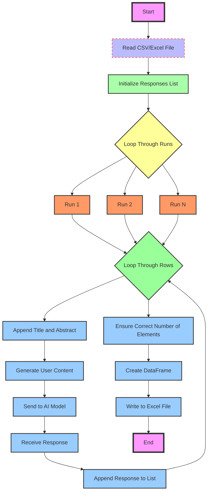
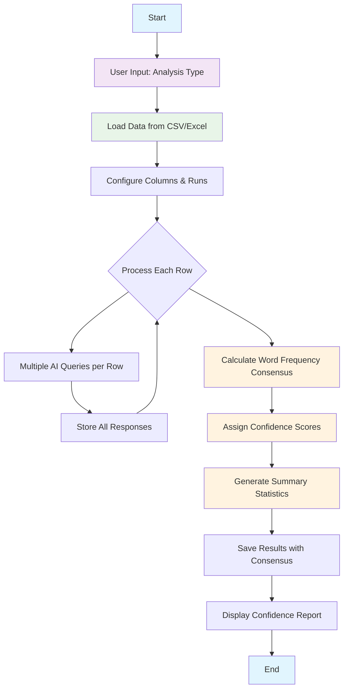

# AI Assisted Analysis Tool - Technical Documentation

## Getting Started

1. **Clone the repository**
   ```powershell
   git clone https://github.com/hleve/AI_Assisted_Analysis_Tool.git
   ```

2. **Install dependencies**
   ```powershell
   pip install -r requirements.txt
   ```

3. **Run the main script**
   ```powershell
   python ai_assisted_analysis.py
   ```

4. **Explore analysis modules**
   - `other_analysis/ai_response_aggregation.py`: Aggregates AI responses
   - `python_for_Zotero_abstracts/`: Contains thematic and methodological analysis scripts

---

This document provides detailed technical information about the AI Assisted Analysis Tool, including implementation details, model choices, data management strategies, and workflow processes.

## Table of Contents
1. [Model Selection and Performance](#model-selection-and-performance)
2. [Data Management Strategy](#data-management-strategy)
3. [Project Architecture](#project-architecture)
4. [Package Dependencies](#package-dependencies)
5. [Workflow Processes](#workflow-processes)
6. [Consensus Algorithm](#consensus-algorithm)
7. [File Structure](#file-structure)
8. [Troubleshooting](#troubleshooting)

## Model Selection and Performance

### Model Evaluation Process
The model selection process involved testing several LLMs available through Ollama:

- **TinyLlama**: Initially tested as the smallest available model, but produced inconsistent and unreliable results
- **Llama3.3**: Provided high-quality outputs but was too resource-intensive and slow for batch processing
- **Gemma2 (9B)**: Selected as the optimal balance between performance and efficiency
  - Default quantization (9B parameters)
  - Excellent instruction following
  - Reasonable processing speed for bulk analysis
  - Consistent output quality

### Model Configuration
```python
# Model call configuration used throughout the project
response = chat(model="gemma2", messages=[
    {
        "role": "user",
        "content": f"{prompt} {content}"
    }
])
```

## Data Management Strategy

### Folder Structure
The project uses a clean separation between code and data to enable sharing while protecting sensitive information:

```
AI_Assisted_Analysis_Tool/
├── Data_Input/          # User places CSV/Excel files here
├── Data_Output/         # Generated analysis results
├── other_analysis/      # Analysis scripts
├── python_for_Zotero_abstracts/  # Zotero-specific tools
└── requirements.txt     # Python dependencies
```

### Data Privacy
- **Local Processing**: All analysis runs locally using Ollama
- **No Cloud Dependencies**: Data never leaves the local machine
- **Institutional Compliance**: Designed for environments with strict data handling requirements
- **Reproducible**: Code can be shared without exposing research data

## Project Architecture

### Core Components

#### 1. Custom Analysis Engine (`custom_analysis.py`)
- **Purpose**: Flexible analysis tool for any CSV/Excel data
- **Features**: User-defined prompts, column selection, multiple runs per item
- **Output**: Raw AI responses for each content item

#### 2. Response Aggregation (`ai_response_aggregation.py`)
- **Purpose**: Post-process multiple AI responses to find consensus
- **Algorithm**: Word frequency analysis across responses
- **Output**: Consensus results with confidence scoring

#### 3. Integrated Analysis (`custom_analysis_with_aggregation.py`)
- **Purpose**: Combined workflow running analysis and aggregation in sequence
- **Benefits**: Streamlined process, automatic consensus calculation
- **Output**: Complete results with consensus and confidence metrics

#### 4. Zotero-Specific Tools
Individual scripts for common bibliographic analysis tasks:
- `theory.py` - Urban planning theory identification
- `methods.py` - Research methodology extraction
- `results.py` - Results summarization
- `location.py` - Geographic location identification
- `n_themes.py` - Theme extraction

## Package Dependencies

### Core Requirements
```
ollama==0.3.3          # AI model client
pandas==2.2.3          # Data manipulation
tqdm==4.66.6           # Progress bars
openpyxl==3.1.5        # Excel file support
```

### Installation Resolution
Recent updates fixed package naming issues:
- **Issue**: `requirements.txt` originally contained `ollama_python`
- **Solution**: Updated to correct package name `ollama`
- **Addition**: Added `openpyxl` for robust Excel file handling

### Virtual Environment Setup
```bash
# Create virtual environment
python -m venv venv

# Activate (Windows)
.\venv\Scripts\activate.bat

# Install dependencies
pip install -r requirements.txt

# Install Ollama model
ollama pull gemma2
```

## Workflow Processes

### Standard Analysis Workflow



### Integrated Workflow (New)



### Process Flow Details

1. **Data Ingestion**
   - Automatically detect CSV or Excel files in `Data_Input/`
   - Support for user-defined column mapping
   - Flexible identifier column (auto-numbering or user-selected)

2. **Analysis Execution**
   - Configurable number of runs per content item
   - Progress tracking with `tqdm` progress bars
   - Error handling and logging for failed AI requests

3. **Consensus Calculation**
   - Word frequency analysis across all responses (within-model consensus is computed per model across replicate runs)
   - Optionally compute between-model consensus across models' within-model consensus columns when multiple models were used
   - Confidence scoring based on agreement levels
   - Fallback to most common full response if no word consensus

4. **Output Generation**
   - Excel files with all original responses preserved
   - Additional consensus columns with confidence metrics
   - Summary statistics for quality assessment

## Consensus Algorithm

### Algorithm Overview
The consensus mechanism employs a sophisticated word-frequency approach to identify agreement across multiple AI responses:

### Step-by-Step Process

1. **Response Normalization**
   ```python
   normalized_responses = [re.split(r'\s+', str(r).lower().strip()) for r in responses]
   ```

2. **Word Frequency Analysis**
   ```python
   all_words = [word for response in normalized_responses for word in response if word]
   word_counts = Counter(all_words)
   ```

3. **Consensus Identification**
   ```python
   consensus_words = [word for word, count in word_counts.items() if count > 1]
   ```

4. **Confidence Calculation**
   ```python
   confidence = len(consensus_words) / total_unique_words
   ```

### Confidence Levels
- **High Confidence (≥70%)**: Strong agreement across responses
- **Medium Confidence (40-69%)**: Moderate agreement, generally reliable
- **Low Confidence (<40%)**: Poor agreement, requires manual review

### Edge Cases Handled
- **Single Response**: Automatic confidence of 100%
- **No Word Consensus**: Falls back to most frequent complete response
- **Empty/Error Responses**: Handled gracefully with appropriate confidence scores

## File Structure

### Input Files
- **CSV Format**: Standard comma-separated values
- **Excel Format**: .xlsx files supported via `openpyxl`
- **Column Flexibility**: Any column can serve as identifier or content

### Output Files
Standard naming convention: `{original_filename}_{analysis_type}_with_consensus.xlsx`

### Output Columns
| Column | Description |
|--------|-------------|
| `Identifier` | Row identifier (user-selected or auto-generated) |
| `Content` | Original content that was analyzed |
| `Response_1` to `Response_N` | Individual AI responses |
| `Consensus_Result` | Agreed-upon result from consensus algorithm |
| `Consensus_Confidence` | Numerical confidence score (0.0-1.0) |

## Troubleshooting

### Common Issues and Solutions

#### Import Errors
**Problem**: `ModuleNotFoundError` for packages
**Solution**: 
```bash
# Ensure virtual environment is activated
.\venv\Scripts\activate.bat

# Reinstall requirements
pip install -r requirements.txt
```

#### Ollama Connection Issues
**Problem**: Cannot connect to Ollama service
**Solution**:
```bash
# Ensure Ollama is running
ollama serve

# Verify model is available
ollama list

# Pull model if missing
ollama pull gemma2
```

#### Excel File Errors
**Problem**: Cannot write Excel files
**Solution**: Ensure `openpyxl` is installed for Excel support

#### PowerShell Execution Policy (Windows)
**Problem**: Cannot activate virtual environment
**Solution**:
```powershell
# Use batch file activation
.\venv\Scripts\activate.bat

# Or bypass policy temporarily
powershell -ExecutionPolicy Bypass -File .\venv\Scripts\Activate.ps1
```

### Performance Optimization

#### Memory Management
- Process large datasets in chunks if memory issues occur
- Close Excel files before processing to avoid conflicts

#### Speed Optimization
- Use smaller models for faster processing (trade-off with quality)
- Reduce number of runs per item for quicker results
- Process subsets of data for testing before full runs

### Error Recovery
- All errors are logged with row and run information
- Failed responses are marked as "Error occurred"
- Analysis continues even if individual queries fail

## Version History

### Recent Updates
- **Package Dependencies**: Fixed `ollama_python` → `ollama` naming issue
- **Excel Support**: Added `openpyxl` for robust Excel handling
- **Integrated Workflow**: New `custom_analysis_with_aggregation.py`
- **Enhanced Consensus**: Improved algorithm with better confidence scoring
- **Documentation**: Comprehensive technical documentation added

### Future Enhancements
- Support for additional file formats (JSON, CSV with custom delimiters)
- Web interface for easier configuration
- Batch processing across multiple files
- Custom consensus algorithms