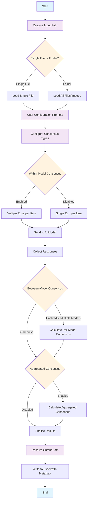

# AI Assisted Analysis Tool - Technical Documentation

## Executive Summary
This document provides technical reference material for developers and researchers using the AI Assisted Analysis Tool. It covers architecture, model selection rationale, data management, the consensus algorithm, and troubleshooting. For a quick start (clone, install, run) and user-oriented overview, see [README.md](#readme.md).

## Getting Started
For a short quick-start guide (clone, install, run), see README.md. This document is focused on implementation details, configuration, and internal workflows.

---

This document provides detailed technical information about the AI Assisted Analysis Tool, including implementation details, model choices, data management strategies, and workflow processes.

## Table of Contents
1. [Model Selection and Performance](#model-selection-and-performance)
2. [Data Management Strategy](#data-management-strategy)
3. [Project Architecture](#project-architecture)
4. [Package Dependencies](#package-dependencies)
5. [Workflow Processes](#workflow-processes)
6. [Consensus Algorithm](#consensus-algorithm)
7. [File Structure](#file-structure)
8. [Troubleshooting](#troubleshooting)

## Model Selection and Performance
The Gemma family of LLMs responds well to the project's prompt structure. Gemma2 and Gemma3 are recommended for text analysis; Gemma3 (12B variant) performs well with images.

### Model Evaluation Process
The model selection process involved testing several LLMs available through Ollama.

- **TinyLlama**: Initially tested as the smallest available model but produced inconsistent and unreliable results.
- **Llama3.3**: Provided high-quality outputs but was too resource-intensive and slow for batch processing.
- **Gemma2 (9B)**: Selected as the default model for text analysis due to a balance of performance and efficiency.
  - Default quantization (9B parameters)
  - Strong instruction following
  - Reasonable processing speed for bulk analysis
  - Consistent output quality
- **Gemma3 (12B)**: Selected as the default model for image analysis because it balances vision capability and performance.
  - Default quantization (12B parameters)
  - Strong instruction following
  - Reasonable processing speed for image analysis
  - Consistent output quality

#### Summary
Gemma models tend to perform better than Llama models at following instructions and avoiding extraneous information for text analysis. GPT-OSS also performs well for text, but due to its size it runs slowly on CPU- or GPU-limited machines. For image analysis, Gemma models perform well; vision capability is generally available at larger parameter sizes (Gemma3). Llava and Llama vision models did not perform well in testing — they often produced irrelevant explanations or had difficulty parsing images.

In general, using the smallest model that meets quality requirements yields the best performance trade-off. A 4-billion-parameter version of Gemma3 can give more consistent results with the project's prompt structure than larger models from other labs.

### Prompt Structure
The analysis code relies on a prompt structure of data description followed by a positive prompt, a negative prompt, and then a second negative prompt telling the model it will not be helpful if it does not follow the prompt. Through testing, the second negative prompt has been useful for Gemma models which really want to be helpful. 

The text
 - 'I am going to give you a chunk of text. Please identify {prompt_desc} used in the text. Do not tell me anything besides {prompt_desc} If you tell me anything besides {prompt_desc} you will not be helptful. The text is:'

### Model Configuration
```python
# Model call configuration used throughout the project
response = chat(model="gemma2", messages=[
    {
        "role": "user",
        "content": f"{prompt} {content}"
    }
])
```

## Data Management Strategy

### Folder Structure
The project uses a clear separation between code and data to enable sharing while protecting sensitive information:

```
AI_Assisted_Analysis_Tool/
├── Data_Input/          # User places CSV/Excel files here
├── Data_Output/         # Generated analysis results
├── other_analysis/      # Analysis scripts
├── python_for_Zotero_abstracts/  # Zotero-specific tools
└── requirements.txt     # Python dependencies
```

### Data Privacy
- **Local Processing**: All analysis runs locally using Ollama.
- **No Cloud Dependencies**: Data does not leave the local machine.
- **Institutional Compliance**: Designed for environments with strict data handling requirements.
- **Reproducible**: Code can be shared without exposing research data.

## Project Architecture

### Core Components

#### 1. Text Analysis Engine (`text_analysis.py`)
- **Purpose**: Analyze tabular data (CSV or Excel) using configurable LLM models.
- **Input Modes**: Single file or folder of files.
- **Features**: 
  - User-defined prompts and custom templates
  - Column selection and flexible identifier handling
  - Multiple runs per row for reliability
  - Three independent consensus types: within-model, between-model, and aggregated
- **Output**: Excel files with all responses and consensus metrics.

#### 2. Image Analysis Engine (`image_analysis.py`)
- **Purpose**: Analyze images using vision-capable LLM models.
- **Input Modes**: Single image or folder of images.
- **Features**: 
  - Vision-enabled model support (e.g., Gemma3 vision)
  - Multiple runs per image
  - Multiple model support for comparison
  - Three independent consensus types
- **Output**: Excel files with image metadata and consensus results.

#### 3. Flexible Input/Output Handling
Both main analysis scripts support:
- **Input**: Single file, folder of files, or interactive path selection
- **Output**: Direct file path, output folder, or automatic placement (defaults to input location)
- **Path Resolution**: Intelligent handling of quoted paths and whitespace cleanup

#### 4. Zotero-Specific Tools (Optional)
Individual scripts for common bibliographic analysis tasks:
- `theory.py` - Urban planning theory identification
- `methods.py` - Research methodology extraction
- `results.py` - Results summarization
- `location.py` - Geographic location identification
- `n_themes.py` - Theme extraction

## Package Dependencies

### Core Requirements
```
ollama==0.3.3          # AI model client
pandas==2.2.3          # Data manipulation
tqdm==4.66.6           # Progress bars
openpyxl==3.1.5        # Excel file support
```

### Installation Resolution
Recent updates fixed package naming issues:
- **Issue**: `requirements.txt` originally contained `ollama_python`
- **Solution**: Updated to correct package name `ollama`
- **Addition**: Added `openpyxl` for robust Excel file handling

### Virtual Environment Setup
```bash
# Create virtual environment
python -m venv venv

# Activate (Windows)
.\venv\Scripts\activate.bat

# Install dependencies
pip install -r requirements.txt

# Install Ollama model
ollama pull gemma2
```

## Workflow Processes

### Standard Analysis Workflow (Text & Image Analysis)


```mermaid
graph TD
    A[Start] --> B[Resolve Input Path]
    B --> C{Single File or Folder?}
    C -->|Single File| D[Load Single File]
    C -->|Folder| E[Load All Files/Images]
    D --> F[User Configuration Prompts]
    E --> F
    F --> G[Configure Consensus Types]
    G --> H{Within-Model Consensus}
    H -->|Enabled| I[Multiple Runs per Item]
    H -->|Disabled| J[Single Run per Item]
    I --> K[Send to AI Model]
    J --> K
    K --> L[Collect Responses]
    L --> M{Between-Model Consensus}
    M -->|Enabled & Multiple Models| N[Calculate Per-Model Consensus]
    M -->|Otherwise| O{Aggregated Consensus}
    N --> O
    O -->|Enabled| P[Calculate Aggregated Consensus]
    O -->|Disabled| Q[Finalize Results]
    P --> Q
    Q --> R[Resolve Output Path]
    R --> S[Write to Excel with Metadata]
    S --> T[End]

    style A fill:#e1f5fe
    style B fill:#f3e5f5
    style C fill:#fff3e0
    style F fill:#f3e5f5
    style G fill:#f3e5f5
    style H fill:#fff3e0
    style M fill:#fff3e0
    style O fill:#fff3e0
    style R fill:#f3e5f5
    style T fill:#e1f5fe
```

### Process Flow Details

1. **Input Resolution**
   - Intelligently handle single files or folders
   - Support for quoted paths and whitespace cleanup
   - Auto-detect file types (CSV, Excel, images)

2. **Configuration**
   - Interactive prompts for all settings or config file input
   - CLI argument support for scripting
   - Config precedence: CLI args -> config file -> built-in defaults

3. **Analysis Execution**
   - Configurable number of runs per item (for within-model consensus)
   - Multiple model support (for between-model consensus)
   - Progress tracking with `tqdm` progress bars
   - Error handling and logging for failed AI requests

4. **Consensus Calculation** (Three Independent Types)
   - **Within-Model Consensus**: Aggregates multiple runs using same model
     - Modes: exact (text match), set (unordered tokens), fuzzy (similarity-based)
     - Produces: `Consensus_{ModelName}` and `Consensus_Confidence_{ModelName}` columns
   - **Between-Model Consensus**: Aggregates per-model consensus results (only if 2+ models)
     - Modes: exact, set, fuzzy (independently configurable)
     - Produces: `BetweenModel_Consensus` and `BetweenModel_Consensus_Confidence` columns
   - **Aggregated Consensus**: Independent consensus across ALL response columns
     - Modes: exact, set, fuzzy (independently configurable)
     - Produces: `Aggregated_Consensus` and `Aggregated_Consensus_Confidence` columns

5. **Output Generation**
   - Excel files with all original responses preserved
   - Additional consensus columns with confidence metrics (based on enabled types)
   - Summary statistics for quality assessment
   - Analysis metadata (models used, run counts, duration, CPU/GPU info)
   - Flexible output path options

## Consensus Algorithm

### Algorithm Overview
The consensus mechanism uses three independent, configurable approaches to identify agreement across multiple AI responses. Each consensus type can be configured independently with different algorithms and parameters.

### Consensus Modes

#### 1. Exact Match Mode
- Finds responses that match completely
- Most restrictive; suitable for categorical or structured responses
- Confidence = (count of most frequent response) / (total responses)

#### 2. Set Mode (Unordered Token Matching)
- Normalizes and tokenizes responses
- Treats responses as sets of words/tokens
- Calculates agreement based on shared tokens
- More flexible than exact match; suitable for variable phrasing
- Confidence = (shared tokens across responses) / (total unique tokens)

#### 3. Fuzzy Match Mode
- Uses token-based similarity matching (via rapidfuzz library)
- Configurable threshold (0.0-1.0) for similarity requirement
- Most flexible; handles paraphrasing and minor variations
- Best for natural language responses
- Confidence = (average similarity of matched responses) / (total responses)

### Step-by-Step Process (Set Mode Example)

1. **Response Normalization**
   ```python
   normalized_responses = [set(re.split(r'\s+', str(r).lower().strip())) for r in responses]
   ```

2. **Token Analysis**
   ```python
   all_tokens = set().union(*normalized_responses)
   token_agreement = {token: sum(1 for r in normalized_responses if token in r) for token in all_tokens}
   ```

3. **Consensus Identification**
   ```python
   consensus_tokens = [token for token, count in token_agreement.items() if count > total_responses // 2]
   ```

4. **Confidence Calculation**
   ```python
   confidence = len(consensus_tokens) / len(all_tokens)
   ```

### Confidence Levels
- **High Confidence (>=70%)**: Strong agreement across responses.
- **Medium Confidence (40–69%)**: Moderate agreement; generally reliable.
- **Low Confidence (<40%)**: Poor agreement; requires manual review.

### Edge Cases Handled
- **Single Response**: Automatic confidence of 100%.
- **No Consensus Found**: Falls back to the most frequent complete response.
- **Empty/Error Responses**: Handled gracefully with confidence score of 0%.
- **Disabled Consensus Type**: Column not generated if consensus type is disabled.

## File Structure

### Input Files

**Text Analysis:**
- **CSV Format**: Standard comma-separated values with configurable columns
- **Excel Format**: .xlsx files with flexible sheet and column selection
- **Input Modes**: 
  - Single file: `python text_analysis.py --input path/to/file.csv`
  - Folder: `python text_analysis.py --input path/to/folder/`
  - Interactive: Script prompts for path if not specified
- **Column Flexibility**: Any column can serve as identifier, content, or be skipped

**Image Analysis:**
- **Supported Formats**: JPG, PNG, TIFF, BMP, GIF, WebP
- **Input Modes**:
  - Single image: `python image_analysis.py --input path/to/image.jpg`
  - Folder of images: `python image_analysis.py --input path/to/images/`
  - Interactive: Script prompts for path if not specified

### Output Files

**Naming Convention:**
- Single file input: `{original_filename}_{analysis_type}_{runs}runs_{models}model.xlsx`
- Folder input: `AI_Analysis_{timestamp}_{runs}runs_{models}model.xlsx`

**Output Path Options:**
- Direct file path: `--output /path/to/output.xlsx` (creates file at specified location)
- Folder path: `--output /path/to/folder/` (auto-generates filename in folder)
- None/Auto: Output placed in same directory as input file (default behavior)

### Output Columns

**Always Present:**
| Column | Description |
|--------|------------|
| `Identifier` | Row/image identifier (user-selected or auto-generated) |
| `Content` | Original content/image name that was analyzed |
| `Response_1` to `Response_N` | Individual AI responses per run |

**Conditional (Based on Configuration):**
| Column | Description | When Present |
|--------|------------|-----------|
| `Consensus_{ModelName}` | Within-model consensus result | If within_model=true & num_models > 1 |
| `Consensus_Confidence_{ModelName}` | Within-model confidence (0.0–1.0) | If within_model=true & num_models > 1 |
| `BetweenModel_Consensus` | Between-model consensus result | If between_model=true & num_models > 1 |
| `BetweenModel_Consensus_Confidence` | Between-model confidence (0.0–1.0) | If between_model=true & num_models > 1 |
| `Aggregated_Consensus` | Consensus across all responses | If aggregate=true |
| `Aggregated_Consensus_Confidence` | Aggregated confidence (0.0–1.0) | If aggregate=true |

## Troubleshooting

### Common Issues and Solutions

#### Import Errors
**Problem**: `ModuleNotFoundError` for packages  
**Solution**:
```bash
# Ensure virtual environment is activated
.\venv\Scripts\activate.bat

# Reinstall requirements
pip install -r requirements.txt
```

#### Ollama Connection Issues
**Problem**: Cannot connect to Ollama service  
**Solution**:
```bash
# Ensure Ollama is running
ollama serve

# Verify model is available
ollama list

# Pull required models
ollama pull gemma2       # For text analysis
ollama pull gemma2:13b   # For larger model
ollama pull gemma3       # For image analysis (vision-capable)
```

#### Model Recommendations
- **Text Analysis**: `gemma2` (9B) - balanced performance/quality
- **Image Analysis**: `gemma3` (12B vision) - supports vision tasks
- **GPU Available**: Use larger variants (13B+) for better quality
- **CPU Only**: Stick with smaller variants (7B) for speed

#### Excel File Errors
**Problem**: Cannot write Excel files  
**Solution**: Ensure `openpyxl` is installed for Excel support.

#### PowerShell Execution Policy (Windows)
**Problem**: Cannot activate virtual environment  
**Solution**:
```powershell
# Use batch file activation
.\venv\Scripts\activate.bat

# Or bypass policy temporarily
powershell -ExecutionPolicy Bypass -File .\venv\Scripts\Activate.ps1
```

### Performance Optimization

#### Memory Management
- Process large datasets in chunks if memory issues occur.
- Close Excel files before processing to avoid conflicts.
- Monitor Ollama memory usage with `ollama serve` logs

#### Speed Optimization
- Use smaller models for faster processing (trade-off with quality)
  - Text: `gemma2:7b` instead of `gemma2:13b`
  - Images: Smaller vision models for faster processing
- Reduce number of runs per item for quicker results (num_runs=2 for testing)
- Disable between-model consensus if only using one model
- Disable aggregated consensus if not needed
- Process subsets of data for testing before full runs

#### Configuration Tips
- Use `exact` match mode for fastest consensus (less computation)
- Use `fuzzy` mode only when needed (slower due to similarity calculations)
- Set appropriate fuzzy threshold (0.7-0.9) to avoid excessive matching

### Error Recovery
- All errors are logged with row and run information.
- Failed responses are marked as "Error occurred".
- Analysis continues even if individual queries fail.

## Version History

### Recent Updates (Current Version)
- **Unified Scripts**: Replaced individual scripts with `text_analysis.py` and `image_analysis.py`.
- **Flexible Input/Output**: Support for single files, folders, and intelligent path resolution.
- **Three Independent Consensus Types**: Within-model, between-model, and aggregated consensus now independently configurable.
- **Enhanced Configuration**: Interactive prompts, config files (YAML/JSON), and CLI argument support.
- **Type Safety**: Added None checks and assertions for robust error handling.
- **Better Metadata**: Comprehensive analysis metadata (models, runs, duration, CPU/GPU info) appended to outputs.

### Previous Updates
- **Package Dependencies**: Fixed `ollama_python` -> `ollama` naming issue.
- **Excel Support**: Added `openpyxl` for robust Excel handling.
- **Integrated Workflow**: Combined analysis and consensus calculation.
- **Enhanced Consensus**: Improved algorithm with better confidence scoring.

## Reporting Analysis in Excel/Spreadsheet software
You can report number of words/numbers by using an H stack to create a count that you can then visualize with a bar chart.
- =SORT(HSTACK(UNIQUE(A2:A100), COUNTIF(A2:A100, UNIQUE(A2:A100))), 2,-1)